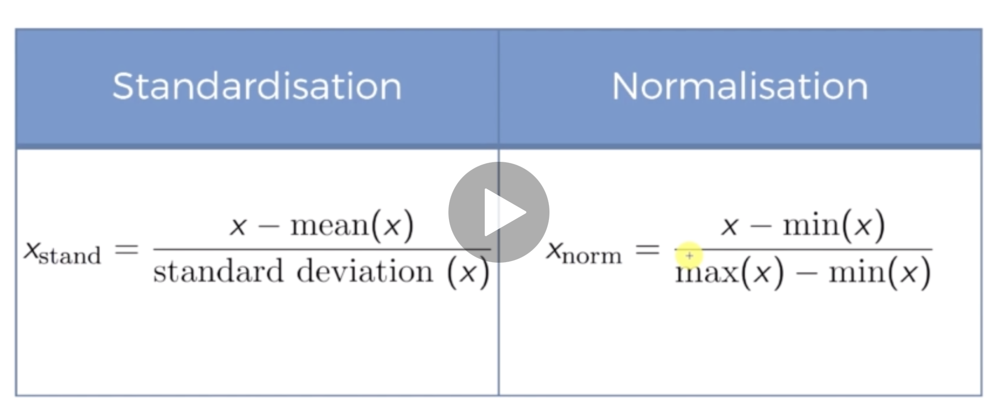
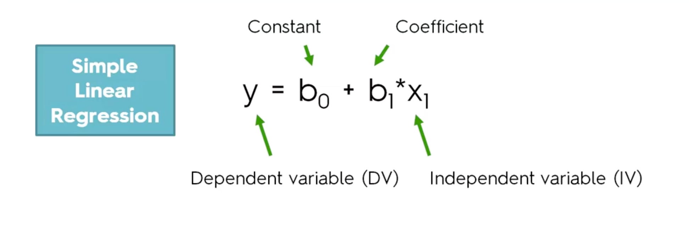
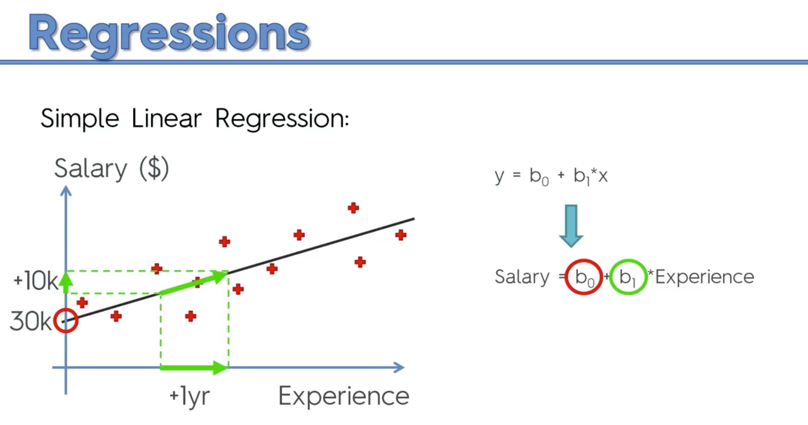
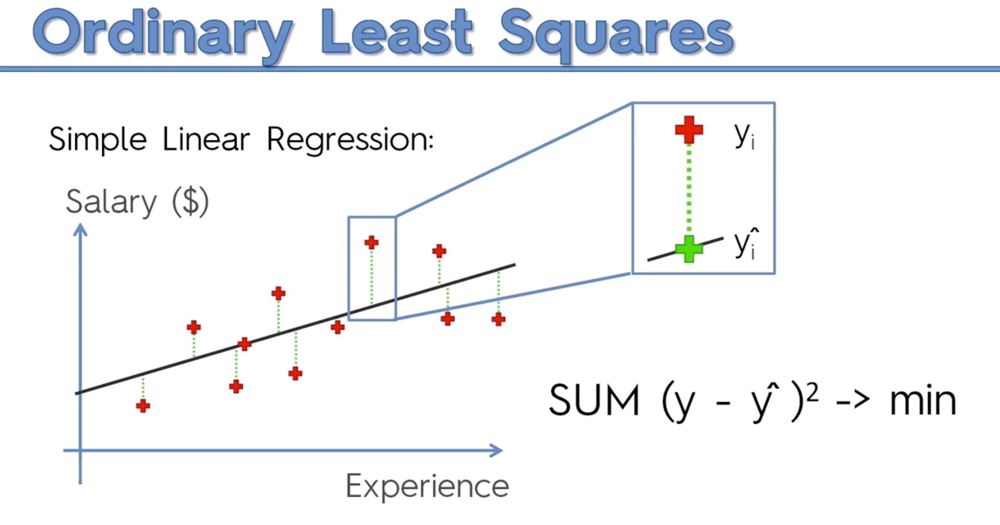
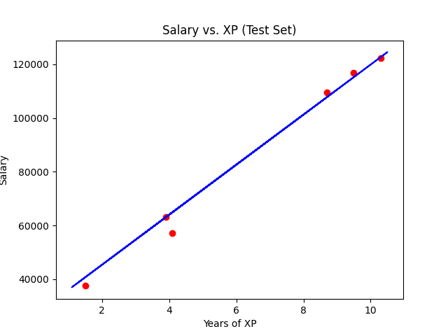

# Machine Learning A-Z: Hands-On Python & R In Data Science

Install packages: `pip3 install $pkg && pip3 freeze > requirements.txt`

# 0. Welcome to the course
## 0.2. Meet your instructors
Hi there,

Hope you are enjoying the course so far!

Not so long ago Hadelin and I did an interview on the SDS Podcast. This is the best place to start if you would like to learn more about his background... and a bit about me too if this is your first course with me :)

Link: 

http://www.superdatascience.com/2

Some of the things you will learn in this podcast:
What is Machine Learning
Mastering Data Science through online courses
What are Recommender Systems
Million dollar question: R vs Python (vs Julia)
What Grand project Hadelin and I are currently working on
Plus you will get an overview of:
Regressions
Classifications
Clustering
Association rule learning
Reinforcement learning
Deep learning


See you in class!

Sincerely,

Kirill Eremenko
___

## 0.3. Learning Path
Hey Data Scientist,

SuperDataScience is bringing you a new learning experience. We know how difficult it is to carve out a career track so we’re introducing the [Machine Learning Skill Track](https://sdsclub.com/learning-paths/machine-learning-track/) to guarantee your way to success.

This Skill Track is a perfect fit if you:
* Struggle to determine the skills you need to succeed in this field,
* Are unsure which courses are right for you,
* Desire to arrange your learning curve efficiently and on your schedule.  

Built to deliver streamlined on-the-job success, the Machine Learning Skill Track provides structured curriculums and discounted courses for in-demand Machine Learning skills.

After completion, Skill Track students will walk away with the required Machine Learning skills and a complete portfolio of work to showcase in competitive job interviews.

Enter this Skill Track to start saving time and money on your Machine Learning journey today.
___

## 0.4. ML vs DL vs AI - What's the difference?
Dear Students,

Kick things off for the course by downloading a helpful cheat sheet: ‘ML vs DL vs AI — What’s the Difference?’ This download addresses one of the most popular questions we hear from students, and hopefully, it clarifies a few lingering questions for you too:

/articles/OU2-Difference-Between-ML-DL-AI.pdf

Enjoy ML!
___

## 0.5. Regression Types
Dear Students,

Watch a great educational video that speaks about the difference between simple linear regression, multiple linear regression, and polynomial regression. Save this resource, or come back and revisit this lecture once you start working on some of the regression models in the course. Please find the video [here](https://www.dropbox.com/s/py3ns8ltraoexfi/Youtube%20-%20Regression%20-%20Video%20Exp%20%232.mov?dl=0).

Enjoy ML!
___

## 0.6. Why Machin Learning is the future?
* For the Dawn of Time until 2005 the human race have created 130 EXABYTES!
* until 2010 that number was : 1,200 EXABYTES
* until 2015 : 7,900 EXABYTES
* estimated for 2020 : 40,900 EXABYTES

Maching Learning can help to use this huge Data more and better.
____

## 0.7. Important notes, tips & tricks for this course
Dear students,

We want you to have the best learning experience during the whole journey of this course. Therefore, please find just below some important notes to understand, as well as tips & tricks to take this course in the best conditions:

1. The practical activities of this course will be done in both Python and R. However, it is absolutely not required to do these practical cases in both programming languages. This course was designed so that people can learn Machine Learning whether they use Python or R in their company, their own business or any specific project. Hence everybody can get comfortable applying Machine Learning on their favorite programming language. But definitely you are not supposed to learn the two. You can do it if you want or if you need it for your work, but usually one of them is sufficient.

2. If you wish to learn both programming languages, just be prepared that there are going to be some repetitions. This is normal, the reasons for this is that there are a lot of similarities between Python and R and of course the practical cases solved in this course are the same for these two programming languages. However, just bear in mind that repetitions are not that bad: you will learn a lot of concepts and techniques in this course and the fact that we repeat the same elements from one programming language to another will help these concepts stick better into your head.

3. The video lectures of this course were recorded at a certain pace so that everybody can adjust the speed to learn at their own rhythm. To adjust the speed you simply need to click the following "Speed" button at the bottom left corner of the video lecture:


    If you find the pace too slow you can increase the speed to 1.25x, 1.5x or even 2x.  
    If you find the pace too fast you can decrease the speed to 0.75x or 0.5x.

4. If there is anything unclear or if you have any question during a Lecture, please keep in mind that there is a very high chance another student asked for some clarifications on the exact same element you need. You can easily find the answer to your question by browsing the Q&A of the specific Lecture you are watching. To browse the Q&A of the Lecture you simply need to click "Browse Q&A" at the bottom of the Lecture:Once you click "Browse Q&A" you will see all the questions and answers related to this Lecture on the right side of the screen:As you can see the questions have titles so you will easily find the same question you are wondering about. If you don't find your question you can of course ask a new question in the Q&A of the Lecture you are in.

We will add more tips & tricks based on our observations of students feedbacks. In the meantime we wish you the best learning experience.

Enjoy Machine Learning!

Kirill & Hadelin
___

## 0.8. This PDF resource will hepl you a lot!
Dear students,

We just made this Latex [PDF](/articles/Machine_Learning_A_Z_Q_A) for you which will considerably help you during your journey in this course. It contains in the first pages the whole structure of the course for you to visualize it clearly, and then 50 pages containing the answers to all the most frequently asked and most important questions, section by section.

In the Table of contents, the sections of the courses are hyperlinked, so you can very easily navigate to the section you want. For example, let's say you are in Part 2 - Regression, in the Multiple Linear Regression section, and you have a question on the Intuition Lectures. Well you just need to go to the Table of contents in the PDF, then go to Part 2 and then click "2.2.1 Multiple Linear Regression Intuition". And this will redirect you to the section you are looking for in the PDF. You may not find your question exactly, but the questions and answers that you will find will definitely bring you more clarity.

This PDF was written in Latex, which means it is super clean. We provided cleaned code snippets, nice charts, and all the mathematical equations to explain some concepts are written clearly.

This PDF will constantly be updated. As soon as we see new important and relevant questions that are repeatedly asked, we will add them in the PDF. Just make sure to re-download it in the course from time to time.

We hope this will help you and make you stronger in Machine Learning, keep up the great work!

Kirill & Hadelin

[PDF](/articles/Machine_Learning_A_Z_Q_A)
___

## 0.9. GET ALL THE CODES AND DATASETS HERE:
Hello my friends,

Please find below the link to the folder containing all the Python codes, R codes, and datasets of this course:

https://drive.google.com/drive/folders/1OFNnrHRZPZ3unWdErjLHod8Ibv2FfG1d?usp=sharing

This folder contains the Python files in .ipynb format, which is the format used to code in Python on Jupyter Notebook or Google Colaboratory.

__Important Note 1:__ Please download this folder on your machine in order to get all the files, especially the datasets which we will have to upload when training the Machine Learning models. In the practical tutorials you will be guided step by step on how to navigate this folder and start coding in Python & R.

__Important Note 2:__ (Python coders only): In order to open the Python files of this folder with Google Colaboratory, you need to have a Gmail account and sign in to that account. This will automatically open this folder on your Google Drive, which will indeed allow you to open the Python files with Google Colaboratory. Then once you open the file, it will be in read-only mode, so in order to code inside you just have to go to File, and then click "Save a copy in Drive...". This will create a copy of this file on your drive, inside which you will be able to code in Python.

Important Note 3 (Python coders only): If you don't want to code on Google Colaboratory and prefer to code on another Python IDE like Jupyter Notebook or Spyder in Anaconda, you can find all the .ipynb files and the .py files in the folder attached at the bottom of this article.

I can't wait to see you in the practical lectures.

Until then, enjoy Machine Learning!

Hadelin
___


## 0.10. Presentation of the ML A-Z folder, Colaboratory, Jupyter Notebook and Spyder
empty
___

## 0.11. Installing R and R Studio
1. https://cran.r-project.org/

2. Download and Install R

3. www.rstudio.com (IDE for R) (For PyCharm: https://www.jetbrains.com/help/pycharm/r-plugin-support.html#get-started)

4. Download and install RStudio
___

## 0.12. Some Additional Resources
Hey Data Scientist,

Congrats on enrolling in the Machine Learning A-Z course!

In order to ease in to this amazing field, we've selected a great episode you can listen to on your commute, at breakfast or wherever. 

Click here to get started: https://www.superdatascience.com/sds-041-inspiring-journey-totally-different-background-data-science/

Enjoy!
___

## 0.13. FAQBot!
Hello Students!

As an additional resource, we are working on deploying our FAQBot (Mango) to help answer any frequently asked - FAQ related questions for the course. You will see Mango (our bot) in the Q&A to help provide access to FAQ based questions and information quickly.

If you have a chance, please feel free test it out using the link mentioned below as we continue training and testing. To be clear, this bot is in early-stage development. Please be aware of any inaccuracy or error while we continue to improve it.

*Mango is still undergoing training, testing, and revisions.

Hi everyone and welcome to our new chatbot! We are hoping to use this chatbot to help answer some of your questions related to the course, or any general course related information to help continue learning. When interacting with the chatbot, please remember that this is a model in training and we expect to have quite a few iterations, development and testing phases to help it learn. Also, please be as clear as possible when asking questions with Mango.

You can ask questions such as:

How can I obtain the certificate of completion?

How to create a virtual environment?

What is the best choice for a programming language in ML or AI?

How to choose the number of hidden layers in a Neural Network?

Can you explain logistic regression?

Can you explain a KNN?

Should I use Python, R or both?

Where can I get the files for ML A-Z?


But please feel free to ask other course related questions so that Mango can learn. *Please keep them course related.

In addition, some other great resources for further information or assistance to help debug any error include the recommended readings, http://stackoverflow.com/, and https://datascience.stackexchange.com/. Our TA’s will do their best to help answer any questions but as DS/ML/AI engineers, becoming comfortable debugging, searching resources and documentation online will become a critical skill for success.

Lastly, please be aware of any errors, or unexpected outcomes. As Data Scientists we consistently need to test, develop and improve our models. We also want to thank you for helping to test our bot, and we hope it helps answer any questions that you might have!

To test Mango directly:

Mango:

https://www.superdatascience.com/pages/welcome-to-faqbot
___

## 0.14. Your Shortcut To Becoming A Better Data Scientist!
Hi Students!

Did you know that by participating in the Q&A it can help:

Make connections with peers within the domain

Reinforce course information

Gain useful insight related to course content

Lead to more course content completed

Improve and obtain better results from specific models

Have your model or customization featured in the course

One main way to help become a better Data Scientist is by joining the discussions. For this, we want to mention the importance of our community of students here. We continuously see and have had students post helpful information, impressive updates and customizations to algorithms that improved results, and have witnessed connections continuously being made in the Q&A.

We have even featured some students' contributions in the course itself! Imagine being able to mention in an interview, or with an employer that your model was featured in a top course in the Data Science or Artificial Intelligence domain?

This leads us to our main point of adding this which is to help emphasize the importance of self learning for this domain. We can easily show you the benefits of helping others (for those of you who are interested, please see here: https://www.mentalfloss.com/article/71964/7-scientific-benefits-helping-others but, in Machine Learning, Artificial Intelligence, Data Science, and any software or programming related career, it will be a required and critical skill to be able to search and solve problems as they develop. This can include any type of common bugs from programs or issues that may pop up due. As libraries, languages and IDE’s are consistently updated, you may run into a bug every so often. This is just part of the nature of the domain that we are in.

Due to this, we want to highlight the importance of self learning and accessing resources such as Google, StackOverflow (or any of the related StackExchanges), or even discussing questions amongst your fellow peers, is a phenomenal way to learn. For those of you who work in the domain, running into problems and solving them is a core method of learning. Personally, answering and debugging questions in the course has helped me become a better AI Engineer/Data Scientist and developer overall.

In addition, if you would like to practice the information from the course, reinforce concepts, and discuss ideas, discussing and answering questions of your peers is another important method to help learn. This can lead to making connections, study groups and habits, and overall improving your course experience by assisting others. Research has also shown that collaboration and participation can lead to increased completion of the material in the course.

To recap, participating in the Q&A in the course can help you with:

Form study habits

Reinforce course information and gain useful insight

Make connections with peers

Improve your overall course learning experience

Altruism

Purpose

*While participating in the Q&A please abide by Udemy’s Terms and Conditions, and be courteous to all participants. We are all on different stages of learning in the course, and every question is a great opportunity to learn!

We greatly appreciate all of the feedback we continuously receive and keep up the awesome work!
___


# 1. Data Preprocessing
## 1.0. Module Introduction
In each section we first start with Python and then do it with the R.
___

## 1.1. Getting Started
[Data.csv](chapter1_data-preprocessing/py/data/Data.csv) : This file here is like a Retail Company which analysis "Which client purchased one of their products, so these the rows (observations) i this dataset correspond to the different customers of this employee, and their infos... and the last column is about if they bought the Product or not."  

You can see that in this there are some empty cells, which makes this data source more realistic.
___

## 1.2. Importing the Libraries (Python)
For Machine Learning in Python we always need at least these three libraries:

* __Numpy__ : To work with arrays and do mathematical operations
* __matplotlib.pyplot__ : Which allows you to create charts
* __pandas__ : which allows you to import dataset and create easily matrices and vectors.

### Installation
So we should install these libraries which we need into our Virtual Env.:
* ``pip install numpy``
* ``pip install matplotlib``
* ``pip install pandas``
___

## 1.3. Importing Dataset (Python)
Data.csv : This file here is like a Retail Company which analysis "Which client purchased one of their products, so these the rows (observations) i this dataset correspond to the different customers of this employee, and their infos... and the last column is about if they bought the Product or not."

``pandas.read_csv()``: This creates a Data Frame from a .csv file.

### Next Steps
After importing Dataset and store it as a Data Frame we need to do these as the next steps:
1. Creating Matrix of Features.
2. Dependent Variable, a Vector.

### Important Principle in Machine Learning
_IN ANY DATASET WHICH YOU ARE GOING TO TRAIN A MACHINE LEARNING MODEL YOU HAVE THE ENTITIES WHICH ARE THE FEATURES AND THE DEPENDENT VARIABLE (two above steps)._

### Features (Independent Variables) - INPUT VALUES
Features are the columns, which are the independent informations (here: Country, Age, Salary), with them you are going to PREDICT the DEPENDENT VARIABLE (here: "Purchased") [Mori: For the future!].

https://pandas.pydata.org/docs/reference/api/pandas.DataFrame.iloc.html  
``.ilock[ROWS, COLUMNS]`` : To locate indexes  (iloc stands for locate indexes)
``.iloc[:, :-1]`` : This takes all the Rows and also all the columns of the dataset, EXCEPT the last column (which is going to be predicted)

### Dependent Variable - TARGET VALUE (y)
This is usually the last column of the dataset (here: PURCHASED)! Because as you may guess, this company will PREDICT some future customers are going to buy the same product based on these informations.
___

## 1.4. For Python learners, summary of Object-oriented programming: classes & objects
Hello students,

For those of you interested in following the Python tutorials of this course, here is a short summary of what you need to know in Object-oriented programming. In the Python tutorials, I will be talking about classes, objects and methods. Please find below a clear explanation of what these concepts are:

A class is the model of something we want to build. For example, if we make a house construction plan that gathers the instructions on how to build a house, then this construction plan is the class.

An object is an instance of the class. So if we take that same example of the house construction plan, then an object is simply a house. A house (the object) that was built by following the instructions of the construction plan (the class).
And therefore there can be many objects of the same class, because we can build many houses from the construction plan.

A method is a tool we can use on the object to complete a specific action. So in this same example, a tool can be to open the main door of the house if a guest is coming. A method can also be seen as a function that is applied onto the object, takes some inputs (that were defined in the class) and returns some output.

Hope this helps you get the intuition of Object-oriented programming, don't hesitate to ask for more explanations in the Q&A if anything is unclear.

Kind regards,

Hadelin
___

## 1.5. Taking care of Missing Data
There are some missing data, which is normal in Machine Learning! If we look at the dataset we see that the Salary in Row 4 and the Age in the Raw 6 are missing.

You can not leave it like that, because it will cause error by training the model, therefore you must handle them. There are actually several ways to handle them:

1. The 1st way is just to IGNORE those Observations which hav missing data and deleting them. And that would be OK if you have a LARGE dataset so if you have for example 1% Missing data, you know that removing 1% of observations won't change much the LEARNING QUALITY of your MODEL. But sometimes you have a lot of missing data and therefore you must handle them the right way.

2. The 2nd way is to REPLACING the missing data by THE AVERAGE OF ALL THE VALUES IN THAT COLUMN (FEATURE), in which the data is missing.

3. Other ways could be to replace the missing value with the Median of that Column (Feature) or with the maximum frequent value in that column.

### Our Goals
* We want to replace the missing salary by the average of all the salaries, this is a CLASSIC WAY of handling missing data.

### Package ``Scikit Learn``
This is one of the important packages by the Data Preprocessing and it has very good tools for that. We will use it a lot in this course.

``pip install scikit-learn``

### How we handle it?
The class from the package Scikit-Learn is called ``SimpleImputer`` , we are actually going to first import that class, then we will create an Instance of that class, this object will allow us to exactly replace the missing salary, by the average of salaries

* `numpy.nan` : this respresents all the missing values in a CSV  
https://numpy.org/doc/stable/reference/constants.html#numpy.nan

* `strategy='mean'` : Replace the missing_values with the average

* ``fit(NUMERICAL_VALUES)`` It looks for the missing value and also calculate the replacement.
___

## 1.6. Categorical Data
What are categorical variables and how to encode categorical data, which is illustrated in Python by `LabelEncoder` and `OneHotEncoder` class from `sklearn.preprocessing` library, and in R the factor function to transform categorical data into numerical variables.

### 1.6.0. Label Encoder vs. One Hot Encoder (More)
So in the first column (Country) we have some countries which can't be understood by our ML Model. So we should make them number, we could have do that with Label Encoder which gives for example to French, Germany, Spain these numbers: 1,2,3  

Now the Problem is that our MODEL is going to misunderstand this, because it's going to compare these values! But we know that the Countries can not be compared like that! So what can help us here is ``One Hot Encoder``! This makes the string data numeric without allowing them to be compared!

(Mori: One-Hot-Encoder make a Unity Matrix (`n * n`) out of the categorical values. Where `n` is going to be the number of values)

IN OUR CASE the OneHotEncoder splits the Country-Column into THREE columns, because we have also 3 countries (If we had 5 Countries, the Country-Col would have been splitted into 5 columns).

THE ONE-HOT-ENCODER CREATES ``BINARY VECTORS`` FOR EACH COUNTRY.

### 1.6.1. Encoding Independent Variable (Features - X)
#### ``sklearn.compose.ColumnTransformer``
* Instructor about Line-32 to Line-34 : We have to enter two arguments:
    1. ``transfomers`` : with that we specify what kind of transformation we are going to do and which indexes of column we want to transform
    2. ``remainder='passthrough''`` : which specifies we actually want to keep the columns which won't get this transformation, meaning "Age" and "Salary" untouched!
    
    3. More details: ``tansformer=[(KIND_OF_TRANSFORMATION, TYPE_OF_ENCODING, COLUMNS_TO_BE_APPLIED)]``
    
    4. `fit_transform()` : It does the both FITTING and TRANSFORMING at once! (This was not possible by ``imputer``, so there we have first used ``.fit()`` and then ``.transform()`` in LINE-24 and LINE-28)
    
    5. LINE-38 : We use ``numpy.array()`` because ``ColumnTransformer()`` does not do that for us. And it should be a Numpy-Array, otherwise our Model can not train with it!
    
    6. _You now know to apply the One-Hot-Encoding when you have several categories in the matrix of features, but also you can do a simple Label-Encoding when you have two classes which you can directly encode to 0 and 1, in other word BINARY OUTCOME._

* https://scikit-learn.org/stable/modules/generated/sklearn.compose.ColumnTransformer.html

* This estimator allows different columns or column subsets of the input to be transformed separately and the features generated by each transformer will be concatenated TO FORM A SINGLE FEATURE SPACE. This is useful for heterogeneous or columnar data, to combine several feature extraction mechanisms or transformations into a single transformer.

* Parameter "transformers" : list of tuples  
List of (name, transformer, column(s)) tuples specifying the transformer objects to be applied to subsets of the data.

* Parameter "remainder" , also called ESTIMATOR.

#### ``sklearn.preprocessing.OneHotEncoder``
* https://scikit-learn.org/stable/modules/generated/sklearn.preprocessing.OneHotEncoder.html#sklearn.preprocessing.OneHotEncoder

* Encode categorical features as a one-hot numeric array.

* The input to this transformer should be an array-like of integers or strings, denoting the values taken on by categorical (discrete) features. The features are encoded using a one-hot (aka ‘one-of-K’ or ‘dummy’) encoding scheme. This creates a binary column for each category and returns a sparse matrix or dense array (depending on the sparse parameter)
___

### 1.6.2. Encoding Dependent Variable (y)
#### ``sklearn.preprocessing.LabelEncoder``
* https://scikit-learn.org/stable/modules/generated/sklearn.preprocessing.LabelEncoder.htm  

* This transformer should be used to encode target values, i.e. ``y`` and not the input ``X``.

* It can also be used to transform non-numerical labels (as long as they are hashable and comparable) to numerical labels.

(Mori:
    * Why is it ok to use LabelEncoder for a Binary Column and not OneHotEncoder?
    
    * Are binary values (True & False) comparable?! In my mind they are two independent states

    * If we had ONLY two values in our categorical columen (for example: category = country , values: France, Germany) would it have been ok to use LabelEncoder instead of OneHotEncoder? Would it have lead to a false training for our Model?
    
    * Is this not ok if we use OneHotEncoder on Dependent Columns?
)
ANSWER: https://en.wikipedia.org/wiki/Binary_data#In_statistics
___

## 1.7. Splitting Dataset into the Training-Set and Test-Set

__Why__ we should split data into training-set and test-set BEFORE feature-scaling?  
(Feature Scaling simply consists of: _Scaling all your variables (features) to make sure they all take values in the same scale. This should be done to prevent one feature domainates the others, which therefore would be neglected by the ML Model._)  

__Answer:__ The reason is simple. Because the Test-Set is supposed to be a __brandnew-set__, on which you are going to evaluate your ML model.  
Feature Scaling is a technique to get the __average__ and __deviation__ of the feature to perform scaling. So if we do this before splitting the Test-Set it causes an __Information Leakage__. (Mori: As if our Machine Learning is cheating!!!)

### 1.7.1 Splitting the Dataset into the Training and Test Set (Python)
In Machine Learning we split our data to a Training-Set and a Test-Set.  
You know that this is about the machine which is going to learn something to make predictions.

Imagine your machine learn too much on a dataset. Then we are not sure if its performance is great on a new set with a slightly different corrolations.

So we should always keep a part of data for the Test!

The performance of the Machine should not be that much different on the Test-Set comparing to Training-Set, so then we can conclude that this Model can understand Correlations (And he did not learn it by heart!) and so it can adapt the new sets of data in new situations.

BETWEEN 20% TO 30% OF DATA IS A GOOD CHOICE FOR THE TEST-PART!

### 1.7.2. How Machine Learns Now?
Now the Machine Learning Model is going to find a CORRELATION between the X_train and y_train and with this Correlation it can predict a new_y for a new_X! or we can test it the quality of its Prediction with the X_test and y_test

___
### 1.7.3. WARNING - Update (Part 1-8)
WARNING - Update
Dear students,

in the following tutorial, the first line of code we will type will be:

`from sklearn.cross_validation import train_test_split `

However the "cross_validation" name is now deprecated and was replaced by "model_selection" inside the new anaconda versions.

Therefore you might get a warning or even an error if you run this line of code above.

To avoid this, you just need to replace:

``from sklearn.cross_validation import train_test_split`` 

by
``from sklearn.model_selection import train_test_split`` 
___

## 1.8. Feature Scaling
### WHAT - Definition
__Feature Scaling is a technique that will put all your features in the SAME RANGE.__    

If we look at our ``Data.csv`` we can clearly see that the values of the Age-feature are NOT in the same RANGE as the values of the Salary-feature the Age-range is from like 0 to 100 and the Salary-Range is from 0 to 100 thousand.

Now we want to put the Age-Range and the Salary-Range in a same range using FEATURE SCALING technique.


### WHY - should we apply Feature Scaling?
For some of the ML Models (not all of them) if your different Features have a huge difference in range of their values, this can cause a __BIAS IN THE CORRELATIONS COMPUTATIONS__.  
In another word, the features that have higher values compared to the other ones will DOMINATE the other features so that these other features may NOT BE CONSIDERED in the Correlation Computation.

So depends on our Model sometimes we need to apply the Feature Scaling and sometimes it is not necessary, because the Model automatically can detect this issue and they fix this with ADAPTING the COEFFICIENTS (For example you see that with the Linear Regression. Linear Regression has some coefficients for each of the Features, so the Features with super HIGH VALUES will get a very LOW COEFFICIENTS. But for other regressions like Logistic Regressions or also the ML Model in R, we should apply the Feature Scaling)

### HOW - Feature Scaling Methods
* Standardisation : taking each value of the feature and subtract it by the Mean and then divided by the Standard Deviation. This puts all the values in range of usually between -3 and +3.

* Normalisation : In this we subtract the values of Feature by the Minimum value of the Feature and then divided by the Range (Max - Min). This will put all the values in the Feature between 0 and 1.



#### Standardisation vs. Normalisation
Which one to choose? Normalisation is recommended if you have a normal distribution in most of your features.  

Standardization actually works well all the time. So we are going to use __Standardization__.

VERY IMPORTANT: For Standardization we need "mean" . We are going to get the Mean of X_train and use it for standardization of both Training-set and also Test-Set (WARNING: We should not take the mean of X_test, because it would - as in the previous lecture said - lead to INFORMATION-LEAKAGE)


``StandardScaler()`` keeps the X as numpy.array so we don't need to apply ``numpy.array()`` in LINE-48. 


ONE IMPORTANT QUESTION: Do we need to apply our Feature-Scaling (here: Standardization) to the Matrix of Features (OneHotEncoder)? The ANSWER is NO! Because the goal of Feature-Scaling is to have value of all features in a same range (somewhere between -3 and +3) for our categorial data which are now vectors of size 1 we don't need to apply the Feature-Scaling for them. Standardization would even make them worse (dummy variable)!

Categorical Data =====(OneHotEncoding)=====> Dummy Variables (Mori: bzw. Einheitsvektoren in N*N Raum!)

### Difference between fit() and transform()
`fit()` __calculates__ the standard-deviation and the mean of each column  

`transform()` maps each cell using the scaling method to its new value (using equation in the above picture)

so X_train looks like this:

```python
[
    [0.0 0.0 1.0 -0.19159184384578545 -1.0781259408412425]
    [0.0 1.0 0.0 -0.014117293757057777 -0.07013167641635372]
    [1.0 0.0 0.0 0.566708506533324 0.633562432710455]
    [0.0 0.0 1.0 -0.30453019390224867 -0.30786617274297867]
    [0.0 0.0 1.0 -1.9018011447007988 -1.420463615551582]
    [1.0 0.0 0.0 1.1475343068237058 1.232653363453549]
    [0.0 1.0 0.0 1.4379472069688968 1.5749910381638885]
    [1.0 0.0 0.0 -0.7401495441200351 -0.5646194287757332]]
```

and X_test looks like this:

```python
[[0.0 1.0 0.0 -1.4661817944830124 -0.9069571034860727]
 [1.0 0.0 0.0 -0.44973664397484414 0.2056403393225306]]
```

We can see that Feature-scaling worked and they are all in the same range (age and salary)
___

# 2. Linear Regression
Regression models (both linear and non-linear) are used for predicting a real value, like salary for example. If your independent variable is time, then you are forecasting future values, otherwise your model is predicting present but unknown values. Regression technique vary from Linear Regression to SVR and Random Forests Regression.

In this part, you will understand and learn how to implement the following Machine Learning Regression models:

* Simple Linear Regression
* Multiple Linear Regression
* Polynomial Regression
* Support Vector for Regression (SVR)
* Decision Tree Classification
* Random Forest Classification

## 2.1. Simple Linear Regression Intuition - Step 1
The linear equation and the name of its components:


So we are going to look at an Example for Linear Regression: In the following we want to know homw the ``salary`` of employees in a company depends on their ``experience``.



### 2.1.1 Explaining The Above Diagram 
So now let's look at the simple in your regression because it's the easiest one to discuss. It's very pretty straightforward you can visualize it quite well.

So here we got the y and x axis. Let's look at that specific example where we have EXPERIENCE and SALARY. So experience is going to be our horizontal axis. Salary is all vertical axis and we want to understand how people's salary depends on their experience.

WELL WHAT WE DO IN REGRESSION IS WE DON'T JUST COME UP WITH A THEORY WE LOOK AT THE EVIDENCE WE'LL LOOK AT THE LIVE HARD FACTS SO HERE ARE SOME OBSERVATIONS WE'VE HAD.

So in a certain company this is how salaries are distributed among people who have different levels of experience and what a regression does.

So that's a formula for aggression. In our case it'll change to salary equals be zero plus ``b_1`` Times EXPERIENCE.

AND WHAT THAT ESSENTIALLY IT MEANS IS JUST PUTTING A LINE THROUGH YOUR CHART THAT BEST FITS THIS DATA and we'll talk about best fitting in the next tutorial when we're talking about ordinary squares.

But for now this is the chart. This is the line that best fits as Darren even looks like it right.
___

### 2.1.2 Coefficient ``b_0``
For now let's focus on the coefficients and the caffeine and the constant.

So what does the constant mean here. Well the that actually means the point where the line crosses the vertical axis and let's say it's $30000.

What does that mean. Well it means that when when experience is zero. So when as you say on the horizontal axis when experience is at zero in the formula on the right you can see that the second part ``b_1`` Times experience becomes zero so salary equals zero.

That means that salary will equal to $30000 when a person has no experience so soon somebody is know fresh from University and joins this company. Most likely they will have a salary about $30000.
___

### 2.1.3. Coefficient ``b_1``
Now what is ``b_1``, ``b_1`` IS THE SLOPE OF THE LINE. 

AND SO THE STEEPER THE LINE THE MORE YOU GET MORE MONEY YOU GET PER EXTRA YEAR OF EXPERIENCE.

Let's look at this. In this particular example let's say somebody went from I don't know maybe four to five years of ``experience``. So then to understand how his salary increase you have to project this onto the line and then project that onto the salary access and you can see that here for one of your experience the person will get AN EXTRA TEN THOUSAND DOLLARS ON TOP OF HIS SALARY.

So if the coefficient ``b_1`` is less, then the slope will be less and that means the salary increase will be less per every year of experience. If the slope is greater then that means the experience will yield more increase in salary and that's pretty much it.
___

That's how a simple your regression works. So the core goal here is that we're not just drawing a line theoretically that we can we came up with

SOME HOW WE'RE ACTUALLY USING OBSERVATIONS THAT WE HAVE TO FIND THE BEST FITTING LINE AND WHAT BEST FITTING LINE IS WE'LL TALK ABOUT THAT IN THE NEXT TUTORIAL.
___

## 2.2. Simple Linear Regression Intuition - Step 2



### 2.2.1. How Find Best Fitting Line
HOW THE LINEAR REGRESSION BEING A TREND LINE THAT BEST FITS YOUR DATA.

Today we'll find out how to find the best fitting light or in fact how the simple linear regression finds that line for you.

So here's our simple your aggression. The same chart salary versus experience. We've got these red dots which represent the actual observations that we have in our data and we've got the TREND LINE WHICH REPRESENTS THE BEST FITTING LINE OR THE SIMPLE LINEAR REGRESSION MODEL.

So now let's draw some vertical lines from the actual observations to the model. And let's look at one of the specific examples to understand what we're talking about here. 

So here you can see that the Red Cross is where that person is sitting at in terms of salary so let's say this person with 10 years of experience is earning $100000.

__-Interpretation-__  
WELL THE MODEL LINE (THE BLACK LINE), IT ACTUALLY TELLS US WHERE THAT PERSON SHOULD BE SITTING ACCORDING TO THE MODEL IN TERMS OF SALARY AND ACCORDING TO MODELS SHOULD BE A BIT LOWER. It should be somewhere without green crosses which is about maybe let's say thousand.

### 2.2.2. Green And Red Pluses in Diagram:
So now the Red Cross is called ``y_i``. And that is the ACTUAL DURATION.

The Green Cross is called ``y_î`` (Y_i-hat)  is THE MODEL THE OBSERVATIONAL. or THE MODELED VALUE.

So basically with those that level of experience where would he be. Where does the model predict that he would be earning.

And so the green line therefore is the difference between what he's actually earning and what he should be earning.

So it should be what he's modeled to be earning. So therefore the green line will be the same regardless of what dependent variable you have whether it's salary or with it's grade school whatever. So it's the difference between the observed and the modeled for that level of independent variable.

### 2.2.3. How Linear Regression Works!
Now to get this best fitting line what is done is you take the sum you take each one of those green lines are those distances (``y_i - y-î``) you square them and then you take some of those squares.

Once you have the sum of the squares for you got to find the MINIMUM of this ``SUM``!

So basically what a simple linear regression does is it draws lots and lots and lots of these lines. These trend lines all this is like a simplistic way of imagining the linear regression draws all these all possible trend trend lines (_Mori: Trend Lines are those vertical green lines!_) and counts the sum of those squares every single time.

And it store these SUMs somewhere in a temporary you know file or something like that and then 

IT FINDS THE MINIMUM ONE SO IT LOOKS FOR THE MINIMUM SUM OF SQUARES AND FINDS A LINE WHICH HAS THE SMALLEST SUM OF SQUARES POSSIBLE.

and that line will be the best fitting line and that is called the ordinary least squares method.

So that's how the simple linear regression works and look for you on the next tutorial.

___

## 2.3. Simple Linear Regression in Python - Step 1
In the example `Salary_Data.csv` we have 30 dataset and the goal is to create a linear regression based on Years-of-Experience (Indep. Variable X) and Salary (Depend. Variable Y). And using that our model should predict other salaries based on other years of experiences.

In this lecture we implement:
1. Import CSV using pandas
2. Set the X and y
3. Split dataset into training-set and test-set
___

## 2.4. Simple Linear Regression in Python - Step 2
Now in this lecture we want to TRAIN our model!

__Regression vs. Classification__  
Regression is when our model predict a continuous real value (e.g. Salary). Classification is when the model predict the category/class (We attend it in the comming lectures).

`LinearRegression.fit()` : This function train our model (`regressor` in code)
___

## 2.5. Simple Linear Regression in Python - Step 3
``LinearRegression.predic()`
___

## 2.6. Simple Linear Regression in Python - Step 4
__Visualization__  
We want make plot out of our dataset and the prediction.

`pyplot.scatter(X_train, y_train, color='red')` : This will plot the red points corresponding to the real salleries in a 2D plot.

Now we want to plot the Regression Line. For that we use `pyplot.plot()`

`pyplot.show()` : It displays the graphic.

The result of these two plots:

For training set the line should looks already good, because the model has trained with these dataset



But important is the Regression Line on the Test-Set! and it looks acceptable:


Please notice that these precise lines won't happen for all the datasets! Here our dataset had intentionally some linear correlations between salary and expreience!!
___

## 2.7. Simple Linear Regression in Python - Additional Lecture
Hello friends!

When discussing Linear Regression, two questions arise frequently from data science students, and now we’re showing you how to solve them in a free BONUS exercise.

Question 1: How do I use my simple linear regression model to make a single prediction, for example, to predict the salary of an employee with 12 years of experience?

Question 2: How do I get the final regression equation y = b0 + b1 x with the final values of the coefficients b0 and b1?

To help you tackle these common challenges, I’ve created a BONUS that addresses the concepts and steps you need to solve them—code included!

Access the detailed answers to two of our most frequently asked questions in this bonus Colab file [here](https://www.superdatascience.com/pages/ml-regression-bonus-1):

https://www.superdatascience.com/pages/ml-regression-bonus-1

Enjoy this BONUS!
___

# 3. Multiple Linear Regression

## 3.1. Dataset + Business Problem Description
This is like a very realistic life-like challenge.

* We have 50 companies
* The first 3 features are their costs. (i.e. R&D Spend, Administration, Marketing Spend)
* One categorical feaature, i.e. "state"
* and the dependent feature (y), which our Model should at the end predict: __Profit__

Aufgabe: Ein Investition-Unternehmen (Venture-Kapitalist) hat Sie als Data-Scienstist eingestellt um herauszufinden, Investieren in welche
von diesen 50 Firmen sinnvoller waere (auf der Basis von "Profit")  

Venture-Kapitalist möchte auch feststellen:
* Wo eine Firma besser leistet? (zB in Kalifornien oder New York ?)
* Wie ist die direkte Beziehung zwischn "Marketing Spend" und "Profit" (wenn alle andere Feaatures gleich sind) ?
* Die Ausgabe in "R&D Spend" und "Marketing Spend" , welche ergibt in einen besseren Profit?
___

## 3.2. Multiple Linear Regression Intuition - Step 1
Watch Video. Topic: Multi-Linear Equation

* Multilinear-Regression: it has one Dependent Variable (DV - y) and multiple Independent Variables (IVs - x_1 , x_2, x_3 , ... , x_n)
___

## 3.3. Multiple Linear Regression Intuition - Step 2
**Assumptions of Linear Regressions:**

1. Linearity
2. Homoscedasticity
3. Multivariate normality
4. Independence of errors
5. Lack of multicollinearity
___

## 3.4. Multiple Linear Regression Intuition - Step 3
**Dummy Variables:**

* "state" is a categorical variables
* To let a categorical variable participate in a regression, you should make __dummy variables__ out of it.
___

## 3.5. Multiple Linear Regression Intuition - Step 4
You should always have one dummy variable less than number of your categorical values of the feature. For example if you have 5 States , you should have 4 dummy variables.
___

## 3.6. Understanding the P-Value

## 3.7. Multiple Linear Regression Intuition - Step 5

## 3.8. Make sure you have your Machine Learning A-Z folder ready

## 3.9. Multiple Linear Regression in Python - Step 1

## 3.10. Multiple Linear Regression in Python - Step 2

## 3.11. Multiple Linear Regression in Python - Step 3

## 3.12. Multiple Linear Regression in Python - Step 4

## 3.13. Multiple Linear Regression in Python - Backward Elimination

## 3.14. Multiple Linear Regression in Python - EXTRA CONTENT

## 3.15. Multiple Linear Regression in R - Step 1

## 3.16. Multiple Linear Regression in R - Step 2

## 3.17. Multiple Linear Regression in R - Step 3

## 3.18. Multiple Linear Regression in R - Backward Elimination - HOMEWORK !

## 3.19. Multiple Linear Regression in R - Backward Elimination - Homework Solution

## 3.20. Multiple Linear Regression in R - Automatic Backward Elimination
___
